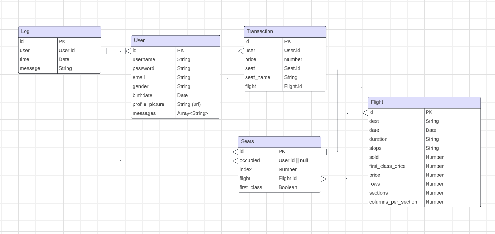

# Endpoints

- [Endpoints](#endpoints)
  - [Users:](#users)
    - [User Schema](#user-schema)
    - [REGISTER_USER](#register_user) 
    - [LOGIN_USER](#login_user) 
    - [UPDATE_USER](#update_user) 
  - [Flights:](#flights)
    - [Flight Schema](#flight-schema)
    - [GET\_ALL\_FLIGHT\_DATA](#get_all_flight_data)
    - [GET\_FLIGHT\_DATA](#get_flight_data)
    - [GET\_ALL\_SEAT\_DATA](#get_all_seat_data)
    - [CREATE\_FLIGHT](#create_flight)
    - [UPDATE\_FLIGHT](#update_flight)
    - [DELETE\_FLIGHT](#delete_flight)
  - [Seats](#seats)
    - [Seat Schema](#seat-schema)
    - [GET\_ALL\_SEAT\_DATA](#get_all_seat_data-1)
    - [UPDATE\_SEAT](#update_seat)
  - [Transactions](#transactions)
    - [Transaction Schema](#transaction-schema)
    - [GET\_ALL\_TRANSACTIONS](#get_all_transactions)
    - [GET\_TRANSACTIONS\_BY\_USER](#get_transactions_by_user)
    - [CREATE\_TRANSACTION](#create_transaction)
  - [Logs](#logs)
    - [Log Schema](#log-schema)
    - [GET\_ALL\_LOGS](#get_all_logs)

# ERD


# Users:

## User Schema 
```ts
    {
        username: String,
        password: String,
        email: String,
        gender: String,
        birthdate: Date,
        profile_pic: String,
        messages: Array<String>,
    },
```

## REGISTER_USER
> `POST /user/`

Registers a user. 

Body: 
```ts
{
    username: String,
    password: String,
    email: String,
    gender: String,
    birthdate: Date,
    profile_pic: String,
},
```

Returns: Success message if successful and error message otherwise


## LOGIN_USER 
> `POST /user/login`

Logs in a user, checking if the user exists and if the password matches. Clears messages under the user. Creates log object for logging login attempts.

Body:
```ts
    {
        username: String,
        password: String,
    }
```

Returns: 
```ts
    {
        userId: User._id,
        messages: Array<String>,
    }
```
if successful, error message otherwise

## UPDATE_USER 
> `PATCH /user/:id`

Updates user based on passed in params. Used for updating fields, forgot password, etc. Username cannot be changed to one already in use. Logs changed password.

Body: 
```ts
{
    id: User._id,
    [key: string]: any // any of the fields in the user object
}
```
Returns: success message if successful, error message otherwise

# Flights:

## Flight Schema 
```ts
    {
        _id: ObjectId
        dest: String,           // e.g. YYZ, NRT, etc.
        date: DateTime,         // e.g. 10-29-2023 3:35AM *SHOULD BE IN UTC!!!!
        duration: Number,       // e.g. 600 *THIS IS IN MINUTES
        stops: String,          // e.g. Non-stop, One Stop
        sold: Number,           // To determine seats sold in O(1)
        first_class_price: Number,
        price: Number,
        rows: Number,
        sections: Number,
        columns_per_section: Number,
    },
```

<!-- seats_per_col represents how wide the plane is. seats_per_section represents how big each section of seats is. This lets us have different sized planes.
```
    xxxxxxxx                xxxxxxxx
    xxxxxxxx
                   vs       xxxxxxxx
    xxxxxxxx
    xxxxxxxx                xxxxxxxx

    32 seats                24 seats
    8 seats_per_col         8 seats_per_col
    16 seats_per_section    8 seats_per_section
``` -->

## GET_ALL_FLIGHT_DATA

Returns an array of all flight data, excluding seat data

> `GET /flights/`

Returns: 
Array\<Flights>


## GET_FLIGHT_DATA

> `GET /flights/:id`

Returns flight data for one flight, and all seats for that flight. 

Returns: 
```ts
    {
        flight: Flight,
        seats: [{
            index: Number,
            occupied: String, // User.username
            first_class: Boolean,
        }]
    }
```

*Example below:*

```ts
    {
        flight: {
            _id: 12931927398,
            dest: "YYZ",
            date: new Date(Date.UTC(2023,11,29,0,35)),
            duration: 950,
            stops: "Nonstop",
            price: 19720,
            id: "1",
        },
        seats: [
            {
                _id: 12931927398,
                index: 1,
                first_class: true
                flight_id: 1,
            },
            {
                _id: 12931927396,
                index: 2,
                occupied: "alice123",
                first_class: false, 
                flight_id: 1,
            },
            .
            .
            .
        ]
    },
```

## CREATE_FLIGHT
> `POST /flights/`

Creates a new flight. Instantiates seats object for the flight.

Body: 
```ts
    {
        dest: String,           // e.g. YYZ, NRT, etc.
        date: DateTime,         // e.g. 10-29-2023 3:35AM *SHOULD BE IN UTC!!!!
        duration: Number,       // e.g. 600 *THIS IS IN MINUTES
        stops: String,          // e.g. Non-stop, One Stop
        first_class_price: Number,
        price: Number,
        rows: Number,
        sections: Number,
        columns_per_section: Number,
    },
```

Returns: Flight Object if successful, error message otherwise

## UPDATE_FLIGHT
> `PATCH /flights/:id`

Updates a flight based on passed in params. Can update any field except for id and seat data. Notifies users who have bought a seat on the flight.

Body: 
```ts
    {
        [key: string]: any // any of the fields in the flight object
    }
```

Returns: Flight Object if successful, error message otherwise

## DELETE_FLIGHT
> `DELETE /flights/:id`

Deletes a flight object. Also deletes all seats associated with the flight, and notifies all users who have bought a seat on the flight.

Returns: Success message if successful, error message otherwise

# Seats
## Seat Schema

```ts
    {
        _id: ObjectId,
        flight_id: Flight._id,
        index: Number, // 0-indexed
        occupied: User._id,
        first_class: Boolean,
    }
```

## GET_ALL_SEAT_DATA

> `GET /seats/:id`

Returns an array of all seat data for a flight. Flight is given as an id

Returns: Array\<Seat>


### Index based

Seats need to be returned in a very exact order:


A1 is 1st element

B1 is 2nd element

C1 is 3rd element

D1 is 4th element

A2 is 5th element

```ts
[
    {
        occupied: true,
        price: 1
    },
    {
        occupied: true,
        price: 2
    },
    .
    .
    .
]
```

## UPDATE_FIRST_CLASS
> `PATCH /seats/:flight_id`

Updates seats to be first class or not. Takes in an array of seat indexes to update.

Body: Array of Seat Indexes

<!-- ## UPDATE_SEAT
> `PATCH /seat/:flight_id`

Updates a seat based on passed in params. Can update any field except for id and flight_id, and index

Body: Seat Object

Returns: Seat Object if successful, error message otherwise -->

# Transactions
## Transaction Schema

```ts
    {
        _id: ObjectId,
        user: User._id,
        flight: String,
        seat: String,
        price: Number,
        date: Date,
    }
```
## GET_ALL_TRANSACTIONS
> `GET /transactions/`

Returns an array of all transactions

Returns: Array\<Transaction> if successful, error message otherwise


## GET_TRANSACTIONS_BY_USER
> `GET /transactions/:user_id`

Returns an array of all transactions for a user

Returns: Array\<Transaction> if successful, error message otherwise

## CREATE_TRANSACTION
> `POST /transactions/`

Creates a new transaction. Updates seat to occupied, and updates flight sold count.

Body:
```ts
    {
        user: User._id,
        flight: Flight._id,
        seat: Seat._id,
        seat_name: String,
        price: Number,
    }
```

Returns: Transaction Object if successful, error message otherwise

# Logs

Logs are created during login attemps, profile edits, and password changes.

## Log Schema
```ts
    {
        id: Number,
        user_id: Number,
        date: Date,
        message: String,
    }
```

## GET_ALL_LOGS
> `GET /logs/`

Returns an array of all logs

Returns: Array\<Log> if successful, error message otherwise